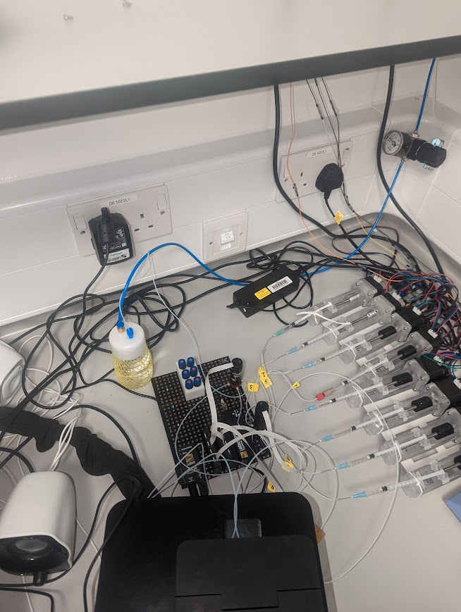

This repository provides additional details pertaining to the ACBC device used to capture, identify and phenotype bacteria from very dillute samples. 
In here you will be able to find information as to the hardware used and software to control the devices and analysis.

Putting the system together:

You will need the following components which you can find in the table below:
| **Item**                                  | **Unit Cost (GBP)** | **Number** | **Cost**   |
|-------------------------------------------|---------------------|------------|------------|
| **Syringe pump components**               |                     |            |            |
| NEMA17                                    | 10.12               | 8          | 80.96      |
| M5 x 90 mm Thread                          | 0.865               | 8          | 6.92       |
| syringe body 3d printed                   | 1.36                | 8          | 10.88      |
| hex nuts and threads                      | 0.175               | 8          | 1.4        |
| Arduino Uno                               | 21.2                | 2          | 42.4       |
| Arduino CNC Shield                        | 12.99               | 2          | 25.98      |
| **Labsmith**                              |                     |            |            |
| Sensor Manifold                           | 150.3538            | 2          | 300.7076   |
| Pressure Sensors                          | 159.7622            | 2          | 319.5244   |
| Tee Interconnect. Ultem® 1/16"            | 22.5492             | 2          | 45.0984    |
| 1x valve starter package                  | 1718.5466           | 1          | 1718.5466  |
| 1x 8-port valve                           | 1012.4092           | 1          | 1012.4092  |
| **3D Printing**                           |                     |            |            |
| Anycubic Mono 4k                          | 155.83              | 1          | 155.83     |
| Anycubic Plant-based resin clear          | 18                  | 1          | 18         |
|                                           | **Total**           |            | **3738.6562** |

