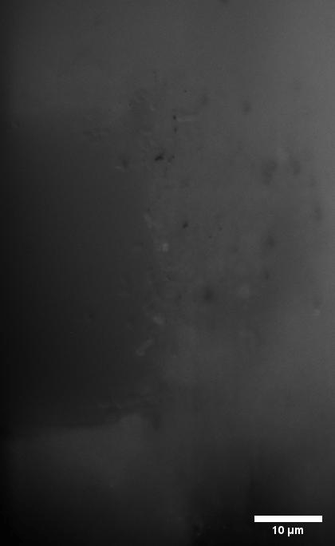
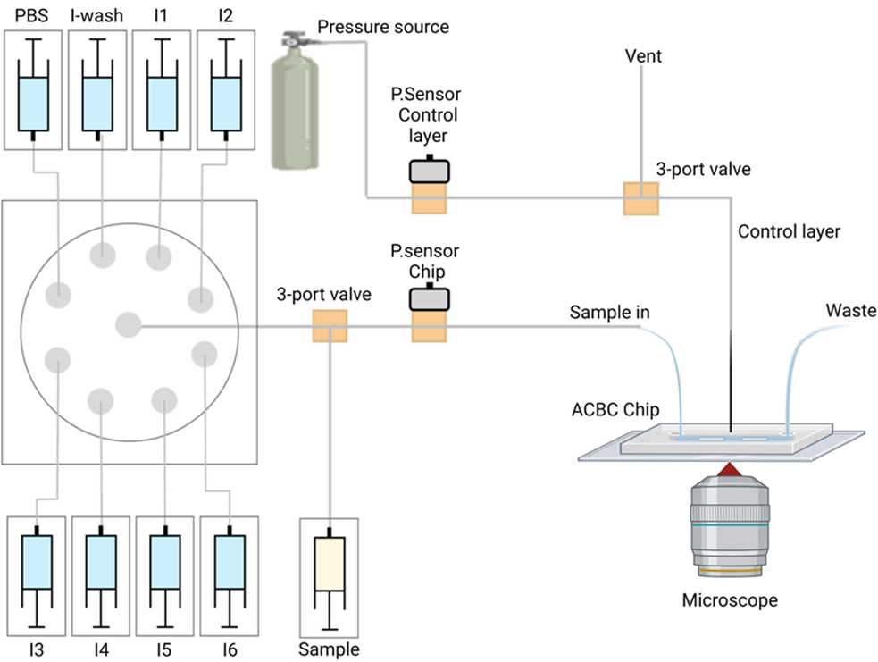

## ACBC Chip
This repository provides additional details pertaining to the ACBC chip used to capture, identify and phenotype bacteria from very dillute samples:
https://doi.org/10.1039/D4LC00325J
For fluidics components used as well as instructions and software control of pumps and valves have a look at the fluidics sub directory.

## Fludics
For fluidics components used as well as instructions and software control of pumps and valves have a look at the [Fluidics](fluidics/) sub directory.

 

## Multiplexed 16S rRNA FISH

For multiplexed 16S rRNA FISH the datasets can be found at the following doi: [10.5281/zenodo.13287507](10.5281/zenodo.13287507)

## AST

For AST work have a look at [AST](AST/)

