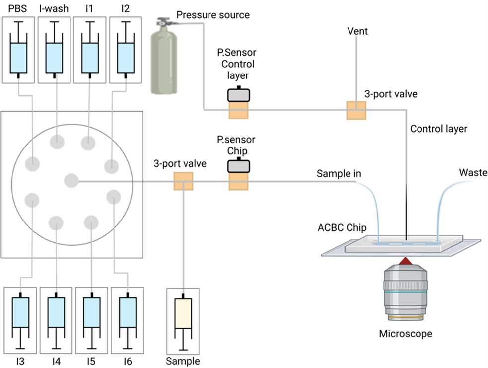

For the fluidic setup the following components were used:

| **Item**                                  | **Unit Cost (GBP)** | **Number** | **Cost**   |
|-------------------------------------------|---------------------|------------|------------|
| **Syringe pump components**               |                     |            |            |
| NEMA17                                    | 10.12               | 8          | 80.96      |
| M5 x 90 mm Thread                          | 0.865               | 8          | 6.92       |
| syringe body 3d printed                   | 1.36                | 8          | 10.88      |
| hex nuts and threads                      | 0.175               | 8          | 1.4        |
| Arduino Uno                               | 21.2                | 2          | 42.4       |
| Arduino CNC Shield                        | 12.99               | 2          | 25.98      |
| **Labsmith**                              |                     |            |            |
| Sensor Manifold                           | 150.3538            | 2          | 300.71   |
| Pressure Sensors                          | 159.7622            | 2          | 319.52   |
| Tee Interconnect. Ultem® 1/16"            | 22.5492             | 2          | 45.10    |
| 1x valve starter package                  | 1718.5466           | 1          | 1718.55  |
| 1x 8-port valve                           | 1012.4092           | 1          | 1012.41  |
| **3D Printing**                           |                     |            |            |
| Anycubic Mono 4k                          | 155.83              | 1          | 155.83     |
| Anycubic Plant-based resin clear          | 18                  | 1          | 18.00         |
|                                           | **Total**           |            | **3738.66** |

-This is how the system was connected: 

Operation:
-Briefly, a sample syringe pump is used to flow the bacterial sample through the device under capturing conditions (in the study a Harvard11 syringe pump was used for this task but any of the custom-made syringe pumps can be used for this task as well).

-Once done with trapping bacteria, a 3way-valve is used to engage the chip with a selection valve containing the FISH reagents. 

-Each reagent is finally delivered through one of the custom syringe pumps.

-Each task can be conducted through the GUI in acbc_multi.py
